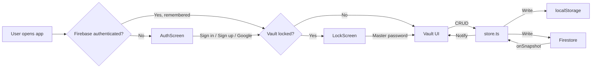

# Phase 2 Walkthrough — SecureVault

## Summary

Migrated SecureVault from a local-only password manager to a cloud-enabled app with Firebase Authentication, Firestore real-time sync, CSV import, and persistent sessions.

## Files Changed

### New Files (5)

| File | Purpose |
|------|---------|
| [firebase.ts](file:///d:/PYTHON/Password%20Manager/src/app/firebase.ts) | Firebase app, Auth, Firestore initialization with `browserLocalPersistence` |
| [auth.ts](file:///d:/PYTHON/Password%20Manager/src/app/auth.ts) | Auth helpers: email signup/signin, Google Sign-In, email verification, sign out |
| [firestore.ts](file:///d:/PYTHON/Password%20Manager/src/app/firestore.ts) | Firestore CRUD: encrypted vault read/write, `onSnapshot` real-time listener, settings sync |
| [AuthScreen.tsx](file:///d:/PYTHON/Password%20Manager/src/app/components/AuthScreen.tsx) | Sign-in / Sign-up / Email verification / Google Sign-In UI |
| [.env](file:///d:/PYTHON/Password%20Manager/.env) | Firebase config template (gitignored) |

### Modified Files (7)

| File | Changes |
|------|---------|
| [store.ts](file:///d:/PYTHON/Password%20Manager/src/app/store.ts) | Dual storage (localStorage + Firestore), real-time sync listener, [bulkAddVaultItems](file:///d:/PYTHON/Password%20Manager/src/app/store.ts#383-403), [migrateLocalToCloud](file:///d:/PYTHON/Password%20Manager/src/app/store.ts#498-510), cloud-first loading |
| [AppShell.tsx](file:///d:/PYTHON/Password%20Manager/src/app/components/AppShell.tsx) | Two-gate system: Auth gate → Lock gate, Firebase auth state listener, loading spinner |
| [LockScreen.tsx](file:///d:/PYTHON/Password%20Manager/src/app/components/LockScreen.tsx) | Cloud-aware master password check, user email display, sign-out link |
| [PasswordList.tsx](file:///d:/PYTHON/Password%20Manager/src/app/components/PasswordList.tsx) | Real-time sync listener, user avatar in header |
| [Settings.tsx](file:///d:/PYTHON/Password%20Manager/src/app/components/Settings.tsx) | Account section, CSV import with preview, sign-out, version 2.0.0 |
| [HomeWrapper.tsx](file:///d:/PYTHON/Password%20Manager/src/app/components/HomeWrapper.tsx) | Passes user and onSignOut through outlet context |
| [App.tsx](file:///d:/PYTHON/Password%20Manager/src/app/App.tsx) | Added Sonner Toaster with dark theme |

## Architecture

## New Features

### Reset Vault (Data Recovery)
Added a fallback for users who forget their master password or encounter stale cloud data. The "Reset Vault" option on the Lock Screen wipes both Firestore and LocalStorage data for a fresh start.

## Visuals

### Authentication Screen
The new two-gate entry system starting with Firebase Auth.

## Build Verification

✅ `npm run build` — succeeded with no TypeScript errors

## Next Step: Final Testing

1.  Open the app in your browser.
2.  Sign in or create a new account.
3.  Set up your Master Password and verify the vault works correctly.
4.  Test adding, editing, and deleting items to confirm cloud sync.
